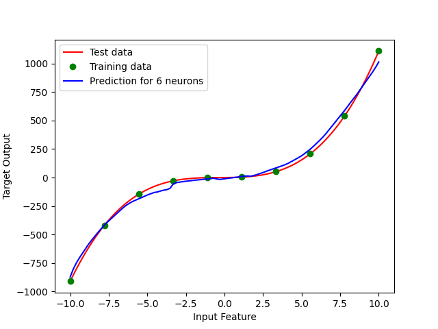
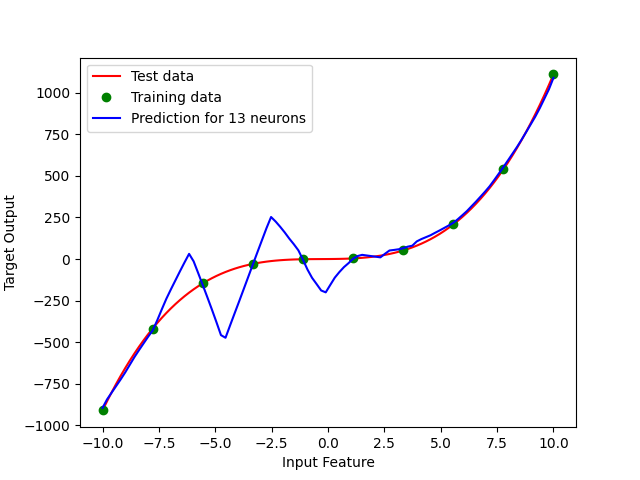
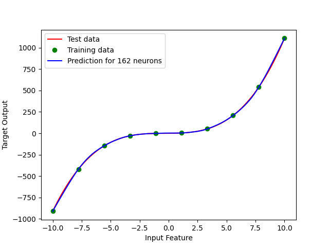
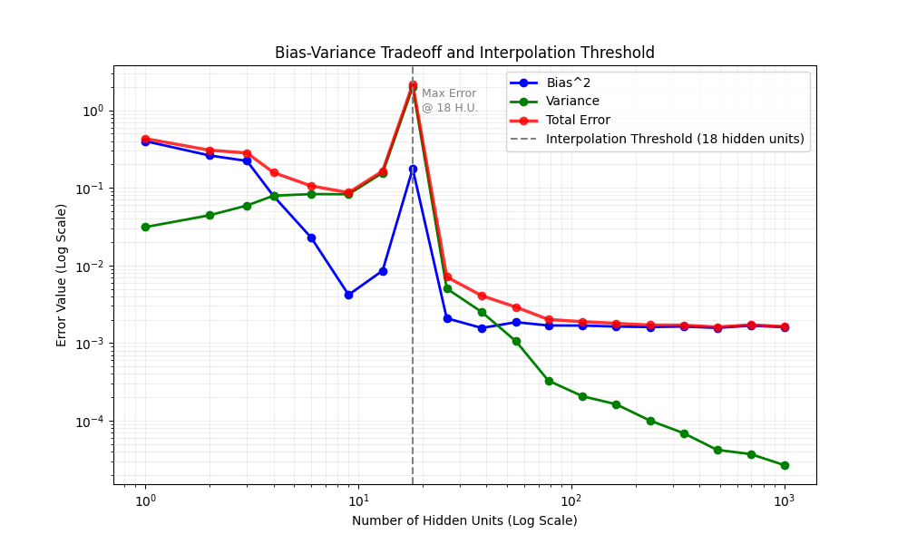

# Double Descent phenomena

Simple experiment aiming to show the double descent phenomena in machine learning.

[How To Run](./INSTALL.md)

---
## Methodology

* We created a simple 2-layer Neural Network, that solved polynomial regression problem.
The size of the hidden network layer was changing, to show all stages of bias-variance tradeoff
* The training data consists of 100 points of a sin(x) or x^3 functions with random noise - than classic training test split

### 1. Underfitting

### 2. Classic Tradeoff

### 3. Overfitting

### 4. New Tradeoff

### Error Graph

